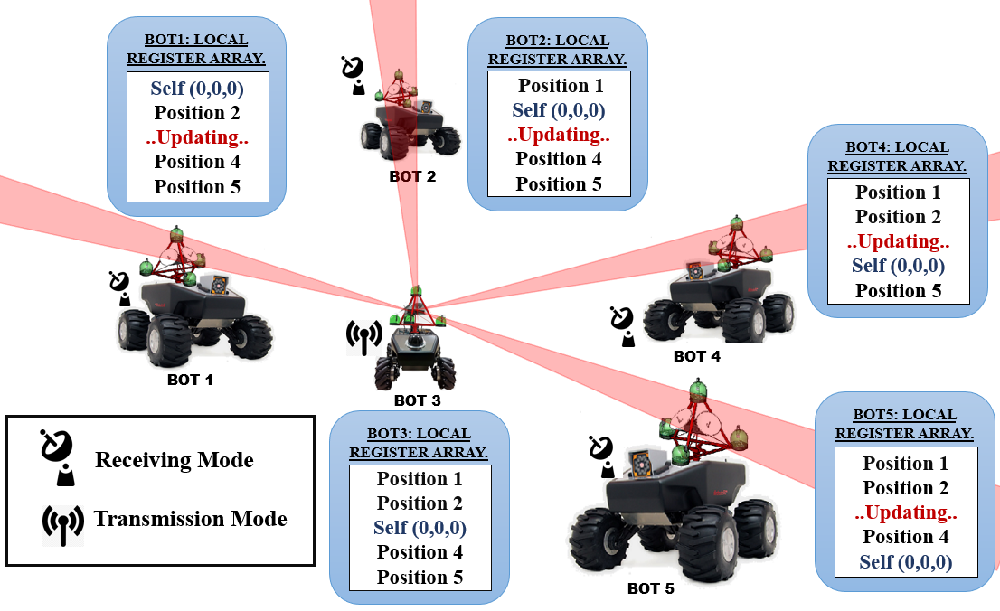

# tetra-edm-localizer
### Tetrahedron and Euclidean Distance Based Decentralized Relative Localization for Multi-Robot Systems

This repository contains code for a multi-robot system localizer that uses euclidian distances and a tetrahedral sensor structure, as described in the paper "Tetrahedron and Euclidean Distance Based Decentralized Relative Localization for Multi-Robot Systems" by Yogesh Phalak and Dr. Shital Chiddarwar, which was published in the proceedings of the IEEE International Conference on Innovation in Technology (INOCON) Bangaluru, India 2020.


<p align="center">
   
</p>

<p align="center">

</p>

## Citation

Please cite the following paper if you use tetra-edm-localizer in your work:

```
@INPROCEEDINGS{9298404,
  author={Phalak, Yogesh and Chiddarwar, Shital},
  booktitle={2020 IEEE International Conference for Innovation in Technology (INOCON)}, 
  title={Tetrahedron and Euclidean Distance Based Decentralized Relative Localization for Multi-Robot Systems}, 
  year={2020},
  volume={},
  number={},
  pages={1-6},
  doi={10.1109/INOCON50539.2020.9298404}}
```
